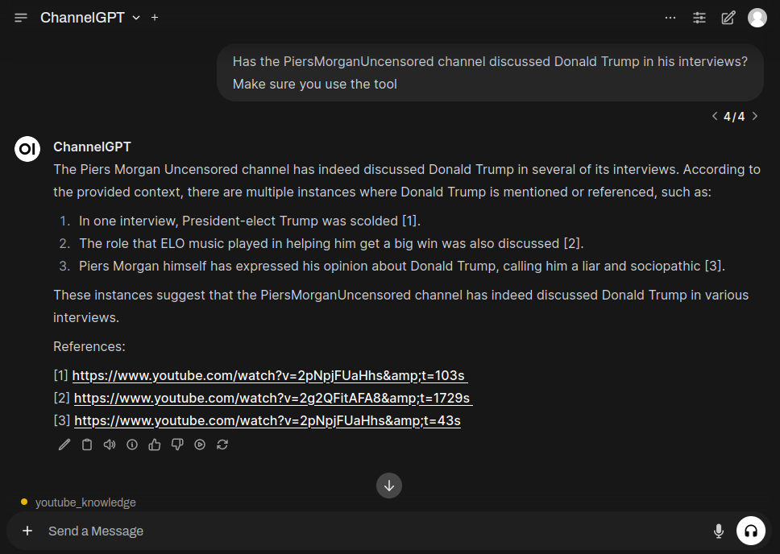

# ChannelGPT-Tool
This project integrates **ChannelGPT** with **Open WebUI**, enabling natural language querying and analysis of YouTube channel content. 

ChannelGPT-Tool is a custom-built application designed to provide advanced querying and analysis of YouTube channel content using AI-driven techniques. By combining powerful open-source models and tools, this project enables users to extract insights from YouTube videos without manually sifting through hours of content. Key features include independent deployment, seamless backend integration, and a user-friendly interface.

<a href="#"></a>

> [!WARNING]
> This project is functional but still in its early phases. Ongoing work is focused on bug fixes and performance improvements.

<div align="center">
  
</div>

## Usage
1.  Clone this repository and navigate to project folder
```
git clone https://github.com/NotYuSheng/ChannelGPT-Tool.git
cd ChannelGPT-Tool
```

2.  Build the Docker images:
```
docker compose build
```

3.  Run images
```
docker compose up -d
```

4.  Access Open-WebUI webpage from host
```
<host-ip>:8080
```

Access FastApi docs page from
```
<host-ip>:8000/docs
```

## How It Works

### 1. User Interaction with Open WebUI
- A user types a query and provides a YouTube channel handle in the **Open WebUI** interface.
- The query and channel handle are sent to an **agent tool**.

### 2. Agent Communication with Backend
- The agent forwards the query and channel handle to a **FastAPI backend server**.

### 3. Building the Knowledge Base
- The backend server uses `yt-dlp` to scrape the provided YouTube channel, collecting:
  - **Video titles**
  - **Video id**
  - **Descriptions**
  - **Transcripts**
- The collected information is processed into smaller **chunks**.
- Each chunk is embedded using a model from **Hugging Face**, converting the content into a format suitable for **similarity searches**.
- The processed chunks are stored in a searchable **knowledge base**.

### 4. Similarity Search for Context
- The server performs a **similarity search** in the knowledge base using the user's query.
- It retrieves the most relevant chunks of information related to the query, along with:
  - **Timestamps**
  - **Links** to specific moments in the videos.

### 5. Sending Context to Agent
- The retrieved video context (key information from relevant videos) is sent back to the **agent**.

### 6. Agent Response to Open WebUI
- The agent uses the **video context** to craft a meaningful response to the user’s query.
- This response is displayed in **Open WebUI**, allowing the user to gain insights without manually searching through the videos.

## Features

- **Ask Questions Easily:** Users can type questions in plain language, and the system will provide answers based on YouTube channel content.
- **No Paid Services Needed:** The system uses free, open-source models from **HuggingFace**, so there's no need to rely on expensive APIs.
- **Automatic Data Collection:** Video information is automatically gathered from YouTube using **yt-dlp**.
- **Backend Server with Knowledge Base:** The backend server stores and processes YouTube data, making it fast and easy to find answers.
- **Web Interface for Users:** The **Open WebUI** provides a simple interface that anyone can use to ask questions and get answers.

## Embedding Models Considered

| Model Name                                                   | Description                                                | Status      |
|--------------------------------------------------------------|------------------------------------------------------------|-------------|
| `sentence-transformers/all-mpnet-base-v2`                    | General-purpose embedding model from Sentence Transformers | ❌ Untested |
| `sentence-transformers/distiluse-base-multilingual-cased-v1` | Multilingual embedding model from Sentence Transformers    | ✅ Tested   |
| `BAAI/bge-large-en-v1.5`                                     | Large English embedding model from BAAI                    | ❌ Untested |
| `BAAI/bge-base-en-v1.5`                                      | Base English embedding model from BAAI                     | ✅ Tested   |

---

### Reference
This project is inspired by the original [ChannelGPT repository](https://github.com/a2ashraf/ChannelGPT) by [a2ashraf](https://github.com/a2ashraf). Significant modifications have been made, including:

- Replacing the **Gradio frontend** with **Open WebUI**.
- Replacing reliance on **OpenAI GPT4** with local LLM server compatible with Open-WebUI like **Ollama**, **vLLM** or **LM Studio**.
- Replacing the **Google API Client Discovery** with **yt-dlp** for web scraping YouTube data.
- Using **Hugging Face models** for embedding channel content.
